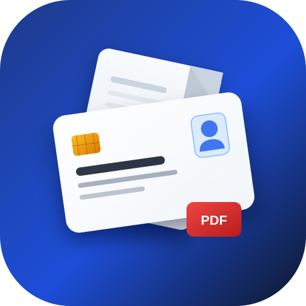

# 🎴 CardPDF 2.0 Pro

**Maquetador y convertidor profesional de carnets e identificaciones a PDF (300 DPI), JPG, PNG y WebP con manipulación directa en tiempo real.**

<div align="center">
  
  <br>
  <p>
    <b>Convierte, personaliza e imprime carnets físicos con medidas exactas y calidad de imprenta.</b>
  </p>
  <p>
    
    
    
    
  </p>
</div>

---

## 🌟 ¿Qué hay de nuevo en CardPDF 2.0?

CardPDF 2.0 es una reconstrucción total del motor y la interfaz, diseñada para ofrecer una experiencia de usuario fluida a 60 FPS, calidad de impresión profesional a 300 DPI y herramientas avanzadas de edición:

### 🖱️ 1. Manipulación Directa en el Canvas
- **Arrastra y posiciona libremente** los carnets directamente sobre la hoja con el mouse o en pantallas táctiles.
- **Manijas de redimensionamiento** en las esquinas para escalar con precisión visual.
- **Sincronización bidireccional inmediata**: Cualquier movimiento en el lienzo actualiza los controles numéricos y viceversa.

### 🧲 2. Guías Magnéticas Inteligentes (Smart Snap)
- Líneas magnéticas de alineación instantánea al centro horizontal, centro vertical, márgenes y alineación entre frente y dorso.

### 📐 3. Medidas Físicas Reales y Soporte de Papel
- Coordenadas y dimensiones en milímetros reales (mm).
- Botón preset **Estándar CR80** (85.6 × 53.98 mm, tamaño oficial de cédulas y tarjetas bancarias).
- Soporte para **A4 internacional** (210 × 297 mm) y **Carta / US Letter** (215.9 × 279.4 mm).
- Orientación vertical (*Portrait*) y horizontal (*Landscape*).

### ✂️ 4. Guías de Corte con Tijera y Esquinas Redondeadas
- Pautas punteadas automáticas de corte alrededor de cada carnet para facilitar el recorte físico tras la impresión.
- Control milimétrico de bordes redondeados (0 mm para esquinas rectas hasta 15 mm).
- Borde sutil opcional para contraste en fondos claros.

### 📑 5. Múltiples Plantillas y Modos de Impresión
- **Frente y Dorso**: Disposición vertical (arriba/abajo) u horizontal (lado a lado).
- **Solo Frente o Solo Dorso**: Ya no se bloquea la aplicación si solo tienes una cara del documento.
- **Multi-Copia (2 Copias y 4 Copias Cuadrícula 2x2)**: Ideal para papelerías y oficinas que necesitan imprimir varios carnets o duplicados en una sola hoja para ahorrar papel.

### 📸 6. Métodos de Carga Ultrarrápidos
- **Pegar desde el Portapapeles (`Ctrl + V` / `Cmd + V`)**: Captura la pantalla y pégala directamente en CardPDF.
- **Captura con Cámara Web / Móvil**: Toma foto a tu carnet con una guía visual de encuadre en pantalla.
- **Cargar Ejemplo con 1 Clic**: Prueba inmediatamente la aplicación con muestras de alta calidad incluidas.
- **Intercambiar Frente ↔ Dorso (Swap)**: Cambia las caras de posición con un solo toque.

### 🎨 7. Filtros y Realce de Documentos
- **Original**: Imagen con colores intactos.
- **Escáner Nítido (Magic Color)**: Aumenta el contraste y la nitidez de los textos para cédulas y fotos con sombras.
- **Fotocopia B&W**: Convierte a monocromático de alto contraste, ideal para impresiones en blanco y negro y ahorro de tinta.
- Sliders de **Brillo** y **Contraste**.
- **Herramienta de Recorte (Crop)**: Elimina mesas o fondos innecesarios con recorte libre o proporción tarjeta.

### ⚡ 8. Salidas de Exportación Versátiles
- **PDF de Alta Definición**: 300 DPI reales y compresión inteligente para archivos ligeros y nítidos.
- **Imágenes en Alta Resolución**: JPG, PNG (sin pérdida) y WebP a 150, 300 o 450 DPI.
- **Impresión Directa (`window.print`)**: Envía la hoja formateada directamente a la impresora sin descargar archivos previos.
- **Copiar al Portapapeles**: Copia la composición final para pegarla directamente en Word, WhatsApp o correo.

### 🌙 9. Interfaz Moderna y Modo Oscuro
- Estética limpia contemporánea inspirada en herramientas profesionales de diseño.
- Soporte completo para Modo Oscuro y Modo Claro con detección y persistencia automática.
- Historial completo de **Deshacer / Rehacer** (`Ctrl + Z` / `Ctrl + Y`).

---

## ⌨️ Atajos de Teclado

| Atajo | Acción |
|---|---|
| <kbd>Ctrl</kbd> + <kbd>V</kbd> / <kbd>Cmd</kbd> + <kbd>V</kbd> | Pegar imagen desde el portapapeles |
| <kbd>Ctrl</kbd> + <kbd>Z</kbd> / <kbd>Cmd</kbd> + <kbd>Z</kbd> | Deshacer último cambio |
| <kbd>Ctrl</kbd> + <kbd>Y</kbd> / <kbd>Cmd</kbd> + <kbd>Shift</kbd> + <kbd>Z</kbd> | Rehacer cambio |
| <kbd>↑</kbd> <kbd>↓</kbd> <kbd>←</kbd> <kbd>→</kbd> | Micro-ajuste de posición del carnet seleccionado (1 mm) |
| <kbd>Shift</kbd> + Flechas | Desplazamiento rápido (5 mm) |
| <kbd>Delete</kbd> / <kbd>Supr</kbd> | Eliminar carnet seleccionado |

---

## 🚀 Uso Rápido

No requiere instalación, Node.js ni compilación en el servidor. Funciona 100% en el navegador:

1. Clona el repositorio:
```bash
git clone https://github.com/estiven-meneses/cardpdf.git
```

2. Abre `index.html` en tu navegador favorito (Chrome, Edge, Safari, Firefox).

¡Listo para usar! También puedes desplegarlo directamente en **GitHub Pages**, **Vercel** o **Netlify** con solo subir los archivos.

---

## 🛠️ Tecnologías Utilizadas

- **HTML5 & CSS3** - Arquitectura semántica y diseño con variables CSS.
- **Tailwind CSS** - Sistema de utilidades para un diseño responsivo y tema oscuro.
- **JavaScript Moderno (ES6+)** - Lógica modular, gestión de estado y render loop a 60 FPS con `requestAnimationFrame`.
- **Canvas API & Offscreen Canvas** - Manipulación gráfica de alto rendimiento con soporte Retina/HiDPI y filtros a nivel de píxel.
- **jsPDF** - Generación y compresión de documentos PDF a 300 DPI.
- **Canvas Confetti** - Micro-interacciones festivas al exportar.
- **MediaDevices API & Clipboard API** - Captura con cámara web y pegado directo desde el portapapeles.

---

## 📄 Licencia

Este proyecto está bajo la Licencia MIT. Siéntete libre de usarlo, adaptarlo y distribuirlo.

---

<div align="center">
  Hecho con ❤️ por <a href="https://github.com/estiven-meneses">Estiven Meneses</a>
</div>
